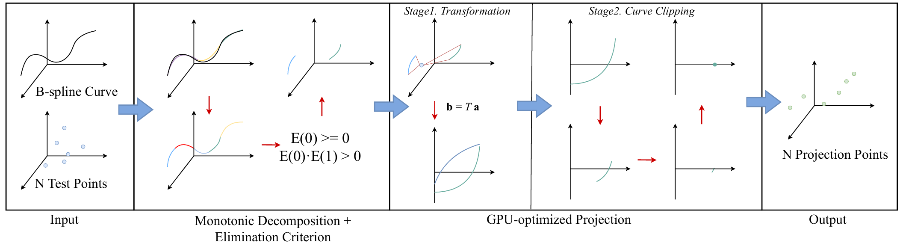

# Matrix representation and GPU-optimized B-spline computing (M-rep)

- By: Jiayu Wu and Qiang Zou
-  email: qzou.code@gmail.com
- webpage: https://qiang-zou.github.io/
- Latest Release: 2025.09

 
<br />

The source code is for the method presented in [1]. It introduces a matrix representation and GPU-accelerated computations for B-spline curves. The key idea is to transform unstructured B-spline data into regular matrices, enabling evaluation and manipulation through matrix computations. Its main advantages are compatibility with GPU kernels, robust performance on complex models, and around two orders of magnitude speedup in inversion and projection tasks.

It can be compiled with GCC 11.4.0 + CUDA 12.2 , and run on the operating system Ubuntu 22.04 LTS. 


1.Copyright
-----------
M-rep is GNU licensed. It is developed by Jiayu Wu, supervised under Qiang Zou, based on [1]. All rights about the program are reserved by Qiang Zou. This source codes are made available only to a primary use for academic purposes. No secondary use, such as copy, distribution, diversion, business purpose, etc., is allowed. In no event shall the author be liable to any party for direct, indirect, special, incidental, or consequential damage arising out of the use of this program. M-rep is self-contained. 


2.Download
----------

- The source code, as well as the testing data, can be downloaded from the page: 
  
  webpage: https://github.com/Qiang-Zou/Matrix-CAD


3.Installing & Compiling (Linux + CUDA12.2 + Cublas + Eigen)
-------------------------------------------

- Download CUDA, Cublas and Eigen library. Please select the appropriate version on the official website.

  CUDA: https://developer.nvidia.com/cuda-toolkit-archive

  Cublas: https://developer.nvidia.cn/cublas

  Eigen: https://eigen.tuxfamily.org/index.php?title=Main_Page

  Before using this code, make sure you have set up the relative third-party library's path.

- Download the source code of this project to a suitable place and make sure the paths of CUDA, Cublas and Eigen are correctly set in the environment. 

4.Usage
-------

- The dataset is in the /dataset

- To visualize the dataset, you can do the following command:

  ```
  cd dataset
  python3 xxx.py # xxx is the curve you want to visualize, there are 18 in total.
  ```

- To test the M-rep for projection, you can do the following command:

  ```
  cd src
  nvcc -o GPU_projection GPU_projection.cu -lcublas -lcusolver
  ./GPU_projection
  ```

- To test the M-rep for inversion, you can do the following command:

  ```
  cd src
  nvcc -o GPU_inversion GPU_inversion.cu -lcublas -lcusolver
  ./GPU_inversion
  ```

- The variable is set in the /lib/DataStructure.cuh

- To modify the relevant variables, you can do the following instructions:

  ```
  cd lib
  vim DataStructure.cuh
  ..... # modify the variable you want
  ```


5.References
-------------
[1] Jiayu Wu, Zhengwen Feng, Qiang Zou, Matrix representation and GPU-optimized parallel B-spline computing, Computer-Aided Design, Volume 189, 2025, 103948.


